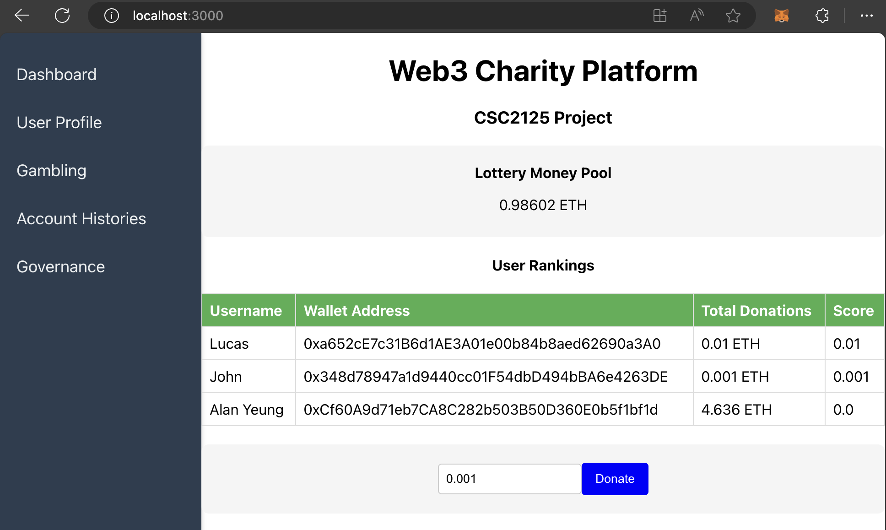

# Introduction

This is a group projecnt for UTSG CSC2125 24S: Blockchain Technology and Engineering. Made by: Junhong(John) Chen, Kailun(Lucas) Jin and Tung Hoi(Alan) Yeung.

# Motivation & Goals

The motivation behind the Web3 Charity Lottery Platform stems from a desire to address inefficiencies and challenges inherent in traditional methods of charitable giving. Key motivations include reducing banking fees associated with donations, promoting the adoption of Web3 technologies, incentivizing philanthropy through lottery participation, and consolidating knowledge in Solidity and the Web3 ecosystem. The platform aims to create a more cost-effective and transparent donation ecosystem while fostering greater user engagement and participation in charitable activities.

# Main Features:

- Users can register or participate in the platform using crypto wallets such as MetaMask and holding NFTs.
  

- Users have the option to make direct donations to the money pool, empowering them to support causes they are passionate about.
  

- Users could engage in competitions, such as donation ranking, and therefore win rewards in cryptocurrencies. User can gamble against the money pool to win money and increase their ranking. For example, John does gambling and gets a profit, and 40% of it will go to the prize pool, 40% will go to John's wallet, and the remaining 20% of it will go to the operational cost(as gas cost). This distribution model ensures that a portion of proceeds is allocated fairly and thus makes the platform sustainable.
  

- Users have the opportunity to vote for NGOs they believe are deserving, particularly those that are historically marginalized. Periodically, the money pool selects the NGO with the highest number of votes and distributes donations accordingly.
  

# Setup

## Environment variable setting

Please reference the `.env.example` and create your own `.env` file

## Local Solidity Deployment

config your hardhat.config.js, put your Alchemy api key and metamask wallet key

```
    sepolia: {
      url: "https://eth-sepolia.g.alchemy.com/v2/xxxxxxxx",
      accounts: [
        `0x{METAMASK_PRIVATE_KEY}`,
      ],
    },
```

## Deploy Solidity code to testnet

```
npx hardhat compile
npx hardhat run scripts/deploy.js --network sepolia
```

npx hardhat run scripts/mint-nft.js --network sepolia

## Start frontend UI

```
npm run start
```

## Start backend Server

```
cd backend
node server.js
```

# Acknowledgement

We thank Dr. Fan Long for his supervision and great support of this work. This work would never have been
possible without his knowledge and great support!
